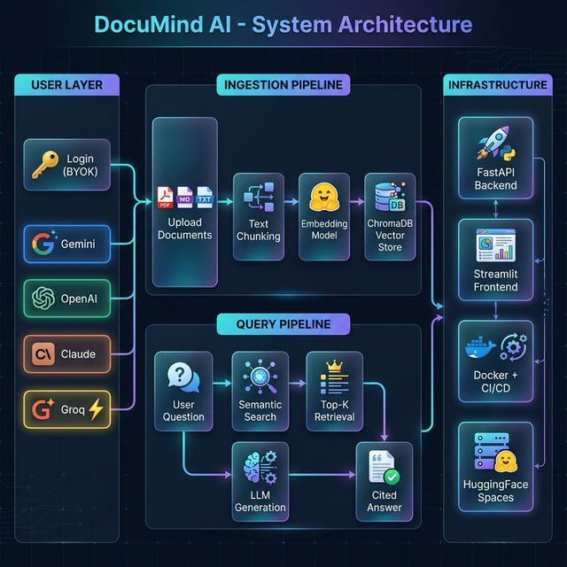

# 🧠 DocuMind AI — Documentation Query System with Semantic Retrieval

[](https://www.python.org/downloads/)
[](LICENSE)
[](https://huggingface.co/spaces/AIenthusSP/RAG-Documind-AI)

A **production-grade, multi-tenant AI documentation assistant** powered by Retrieval-Augmented Generation (RAG). Upload documents, ask questions in natural language, and get instant, cited answers — using your own LLM provider of choice.

## System Architecture



## ✨ Features

- 🔍 **Semantic Search** — Finds answers by meaning, not keywords. "Scaling limitations" matches "performance bottlenecks."
- 🔑 **BYOK Multi-Tenancy** — Bring Your Own Key. Each user's data is fully isolated via API key hashing.
- 🔄 **4 LLM Providers** — Gemini, OpenAI, Claude, and Groq via unified LangChain interface.
- 📚 **Multi-Format Support** — PDF, Markdown, and plain text documents.
- ⚡ **Fast Retrieval** — Sub-2s semantic search with ChromaDB vector database.
- 📊 **Full Observability** — Langfuse tracing and monitoring.
- 🧪 **Automated Evaluation** — Promptfoo quality testing.
- 🔄 **CI/CD Pipeline** — GitHub Actions for testing and deployment to HuggingFace Spaces.

## 🛠️ Tech Stack

| Layer | Technology |
|-------|------------|
| LLM Providers | Gemini · OpenAI · Claude · Groq |
| Orchestration | LangChain + LCEL |
| Embeddings | HuggingFace Sentence Transformers |
| Vector DB | ChromaDB |
| Backend | FastAPI |
| Frontend | Streamlit |
| Observability | Langfuse |
| Evaluation | Promptfoo |
| Deployment | Docker · GitHub Actions · HuggingFace Spaces |

## 🚀 Quick Start

```bash
# Clone the repository
git clone https://github.com/yourusername/rag-docs-assistant.git
cd rag-docs-assistant

# Create virtual environment
python -m venv venv
source venv/bin/activate  # Windows: venv\Scripts\activate

# Install dependencies
pip install -r requirements.txt

# Set up environment variables
cp .env.example .env

# Start backend (Terminal 1)
uvicorn src.api.main:app --reload --port 8000

# Start frontend (Terminal 2)
streamlit run src/frontend/app.py --server.port 7860
```

## 📁 Project Structure

```
rag-docs-assistant/
├── src/
│   ├── api/          # FastAPI backend & routes
│   ├── rag/          # RAG pipeline (retrieval, chunking, generation)
│   ├── llmops/       # LLMOps integrations (Langfuse, guardrails)
│   └── frontend/     # Streamlit UI (login, chat, collections)
├── evals/            # Evaluation datasets & configs
├── tests/            # Unit and integration tests
├── config/           # Configuration files
├── docs/             # Documentation & architecture diagrams
└── .github/          # CI/CD workflows
```

## 🔐 How BYOK Works

1. User enters their API key on the login page
2. Key is hashed (SHA-256) to create a unique `user_id`
3. All collections are namespaced: `{user_id}_{collection_name}`
4. User A cannot see User B's data — complete isolation

## 🗺️ Roadmap

- [ ] Agentic multi-step reasoning for complex queries
- [ ] Knowledge graph extraction and visualization
- [ ] Conflict detection across documents
- [ ] Hybrid retrieval (dense vectors + sparse BM25)
- [ ] Automated RAG evaluation with RAGAS framework

## 📄 License

MIT License — see [LICENSE](LICENSE) for details.
